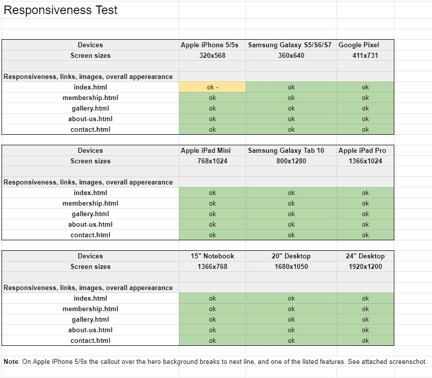
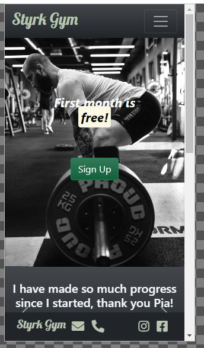
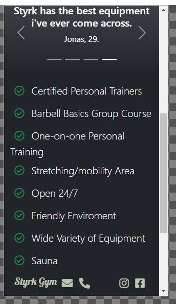

# Styrk Gym

### A gym that is passionate about strength training and barbell movements.

 
## UX
 
Use this section to provide insight into your UX process, focusing on who this website is for, what it is that they want to achieve and how your project is the best way to help them achieve these things.

### Project goals

 The goal of this project is to let the user know that this gym is leaning towards barbell strength training. One of the goals is to get attention and interest even though the user doesn't have much or any experience with this type of training. Styrk Gym is a place that welcomes all types of people. Compared to other gyms, Styrk is more leaned towards compound movements and the sport of lifting. Here, the user can expect squat racks, benches, open spaces  and more. And not rows of threadmills, bikes and your typical cardio equipment. There will be lots of room for acitivity. 

## User Stories

The users of this site will be non-members and members.

As a non-member of this gym, I want:

- To get a quick first impression of what type of gym this is.
- To see the pricing information. Can I expect any starting fees a campain or deals?
- To see how the gym looks like.
- To get an idea of what the type of members this gym has. 
- To know the opening hours of this gym.
- To know what kind of equipment this gym has.
- To know who is running this gym, do they have personal trainers?
- What can I expect to get/learn/experience from this gym. Do they have any classes?

As a member of this gym, I want:

- To see membership alternatives.
- To find the contact information of this gym.
- The ability to see this gym on social media. 
- To know the opening hours of the gym.
- To learn more about the staff.
- To learn more about the training classes they provide.

## Design

The design should represent a gym that focus on barbell movements and compound movements, but also a gym that includes all kinds of people. A friendly enviroment is important to make everyone feel welcome.  

Backgrounds and images: 
The background images for the landing page have been selected because they fit the project goals: To give the user an impression of this being a lifting-based gym, and a gym that includes everyone. That is why the desktop version has a woman squatting with a barbell, and the mobile version has barbell from ground view. 
At the bottom of the landing page, there are two guys fist-bumping, which can give a sense of a good enviroment among members.
The gallery provide images that gives the user an idea of what kind of equipment to expect, images of people training, stretching and having fun.

Fonts: I wanted the logo to be down to earth and a little playful. After a look through the google font library the lobster font just seemed perfect for my project. 
In the "We offer" section of the landing page, the bootstrap "lead" class have been selected because I personally think it looks good.

Styling: X colors have been used throughout the page.

Icons: Icons from fontawesome have been used to display email, telephone and social media in the footer. The email and telephone icons is also used in the contact page.

This section is also where you would share links to any wireframes, mockups, diagrams etc. that you created as part of the design process. These files should themselves either be included as a pdf file in the project itself (in an separate directory), or just hosted elsewhere online and can be in any format that is viewable inside the browser.

Wireframes:  [here](wireframes/) 

## Features

### Existing features:
Navigation bar
Footer: 
Home page:
Membership page:
Gallery page:
About us page:
Contact page:

Features Left to Implement:
 
## Technologies Used

### Tools:

- [Gitpod](https://www.gitpod.io/) used as IDE.
- [GitHub](https://github.com/) used to store and share reposetory.
- [Git](https://git-scm.com/) for version control.
- [Balsamiq](https://balsamiq.com/) for creating wireframes.
- [Google Chrome DevTools](https://developer.chrome.com/docs/devtools/) to view the site in various screen sizes and devices. For trying out style and code without doing any real changes to the page. 
- [Google Lighthouse](https://developers.google.com/web/tools/lighthouse) for testing of performance, accessibility and SEO.
- [Responsive Design Checker](https://www.responsivedesignchecker.com/) for testing of responsiveness on various screen sizes and devices.
- [Microsoft Paint](https://support.microsoft.com/en-us/windows/get-microsoft-paint-a6b9578c-ed1c-5b09-0699-4ed8115f9aa9) for resizing images while maintaining aspect ratio.
- [Coolors](https://coolors.co/), a handy tool for deciding on what colors go well together.

### Libraries:

- [Bootstrap](https://getbootstrap.com/docs/5.0/getting-started/introduction/) for a quick page structure, components, navbar and other elements.
- [Google Fonts](https://fonts.google.com/) as a provider of font styles for my project.
- [Font Awesome](https://fontawesome.com/) as a provider of icons.

Languages:

[HTML5](https://en.wikipedia.org/wiki/HTML5) and [CSS3](https://en.wikipedia.org/wiki/CSS).

## Testing

The testing of this project can be found as a seperate [TESTING.md]() file.

# Testing

## Code testing

Google's Lighthouse Test in Chrome Devtools:

Test score first test:

Test score after improvements:

## Code Validators

[W3C HTML Validator by Direct input](https://www.validator.w3.org/) 
- index.html results: No errors or warnings to show.

- membership.html results: No errors or warnings to show.

- gallery.html results: No errors or warnings to show.

- about-us.html results: No errors or warnings to show.

- contact.html results: No errors or warnings to show.

[W3C CSS Validator via Direct Entry](https://jigsaw.w3.org/css-validator/#validate_by_input)
- style.css results: No errors found.

## Responsiveness

 

## Browser Testing

## User Story Testing

## Bugs

## Deployment
My project was deployed to GitHub pages. 
1. Go to [GitHub](https://github.com/) and sign in to account.
2. Click on your profile menu in the top right corner, then "your repositories".
3. Click on "milestone-project-1" and then click on "settings".
4. Once on this page, scroll down to the "GitHub Pages" section, and select "main-branch". Click save.
5. The page will refresh, and after a short while, scroll down again to the same "GitHub Pages" section. There you will have a green section displaying "Your site is published at ...". The site is now deployed. 
See [GitHub Pages documentation](https://docs.github.com/en/pages).
## Running the Project Locally

This section should describe the process you went through to deploy the project to a hosting platform (e.g. GitHub Pages or Heroku).

In particular, you should provide all details of the differences between the deployed version and the development version, if any, including:
- Different values for environment variables (Heroku Config Vars)?
- Different configuration files?
- Separate git branch?

In addition, if it is not obvious, you should also describe how to run your code locally.

## Credits
### Content
All the text used in this project is made up by me. The brand, contact details, about information, is not real. The street address is real, but not connected to this project.
[W3Schools](https://www.w3schools.com/) provided code to make a [responsive image grid](https://www.w3schools.com/howto/howto_css_image_grid_responsive.asp) on gallery.html and a [responsive Iframe](https://www.w3schools.com/howto/howto_css_responsive_iframes.asp) to contact.html.
I used and modified the code from [CSS Tricks](https://css-tricks.com/perfect-full-page-background-image/) in order to get full width backgrounds that is compatible and responsive.
A styled [Bootstrap](https://getbootstrap.com/docs/5.0/getting-started/introduction/) navbar and carousel was implemented in this project. Styled buttons and modals was also used from their library.
### Media
The images used in this project were downloaded from [Pexels](https://www.pexels.com/) and [Unsplash](https://unsplash.com/). 
### Acknowledgements
My mentor Precious Ijege for guiding, support and pointing me in the right direction.
The Code Institute slack channel for having discussion, questions and answers that contribute to my project.
The web site that inspired my design to some degree  was [Sky Fitness](https://www.skyfitness.no/).
