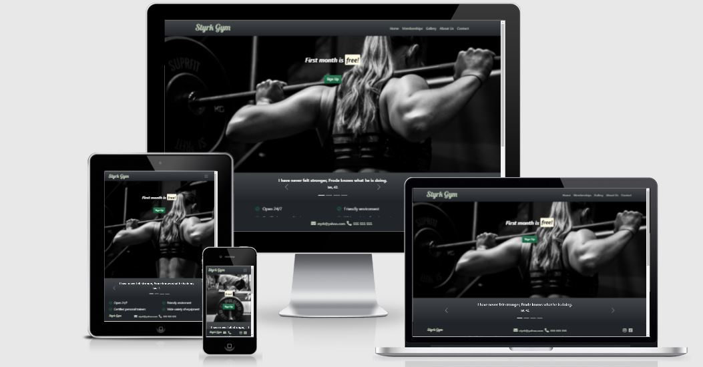
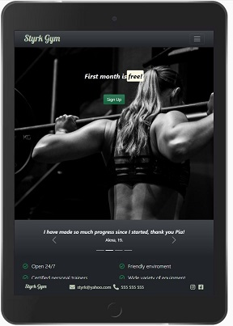
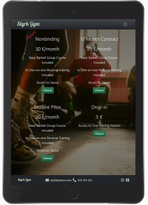
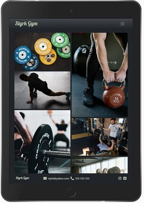
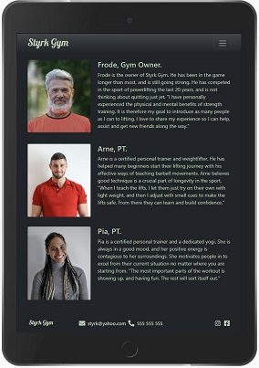
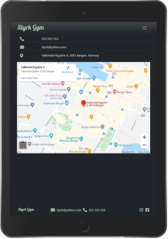
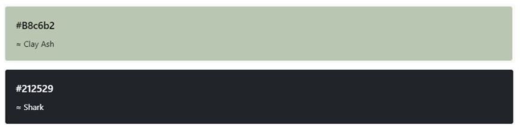

# Styrk Gym

### Styrk Gym is a strength training gym for everyone that loves lifting, with special focus on compound movements using mainly the beloved barbell. Styrk's owner is Frode, and he has two certified personal trainers, Arne and Pia, working for him. They all share the love for the iron, and their combined experience will give any member good results.

To visit the deployed website, click [here](https://hiimus.github.io/milestone-project-1/)

## UX

### Project goals

The goal of this project is to attract and retain new members. Another goal is to let the user know that this gym is leaning towards barbell strength training. This project wants to get attention and interest even though the user doesn't have much or any experience with this type of training. Styrk Gym is a place that welcomes all types of people. Here, the user can expect squat racks, benches, open spaces and more. 

## User Journey

Home page: The user start on the home page. Here they can see what the gym's features are, and quotes from members.

Membership page: The user can learn about the various memberships and what they include.

Gallery page: The user can have a look at the images in the gallery.

About us page: The user can read about the people who work in this gym.

Contact page: The user can find contact information in the contact page.

## User Stories

The users of this site will be non-members and members.

As a non-member of this gym, I want:

- As a non-member, I want to get a quick first impression so that I will get an idea of what kind of gym this is.
- As a non-member, I want to see the pricing information so that I know what I get and pay for.
- As a non-member, I want to see how the gym looks, so that I know if it is the right place for me.
- As a non-member, I want to know what type of members this gym has, so that I feel comfortable in this gym. 
- As a non-member, I want to know the opening hours of this gym, so that I know it suits my schedule.
- As a non-member, I want to know what kind of equipment this gym has, so that I can train with the equipment I want to train with.
- As a non-member, I want to know who is running this gym, so that I can learn more about the owner.
- As a non-member,  I want to know what to get/learn/experience from this gym, so that I can learn something new and get value for my money.

As a member of this gym, I want:

- As a member, I want to see membership alternatives, so that I know what is included and so that I know I have the right membership.
- As a member, I want to find the contact information of this gym, so that I can contact the gym.
- As a member, I want the ability to see this gym on social media, so that I can see and learn more about the gym and the people who train there. 
- As a member, I want to know the opening hours of the gym, so that I know I can train when I want to.
- As a member, I want to learn more about the staff, so I know who they are and their skills/experience.
- As a member, I want to learn more about the training classes they provide, so that I can think about joining one.

## Wireframes

To make [wireframes](/wireframes), I used [Balsamiq](https://balsamiq.com/).

## Features

### Existing features:

#### Header

- Navbar: Contains the brand name and links in desktop view, and a dropdown menu for tablets and smaller screen sizes. The navbar allows the user to intuitively navigate the site. The font for the brand name is "Lobster". The reason behind this is because it is playful and non-formal, which is what I was looking for. I looked for a color with the color picker in Chrome DevTools, and I chose the HEX color #b8c6b2. It personally just looks good and has a nice contrast to the dark #212529 background. See the screenshots below for these colors.

#### Footer: 

- Logo: The logo is also shown in the footer, only smaller and without an anchor link.
- Icons: There are icons in the footer that display an envelope, a phone, and social media icons to instagram and facebook. Only in the mobile view the email and phone number does not display in order to make the footer cleaner. 

The header and the footer are the same across all pages.

#### index.html: 

The home page has two different hero images. On a tablet and larger view, there is a background of a woman squatting with a barbell. This image is selected because it lets the user know straight away what this site is about. It was also selected because it is a woman, and that might increase interest among female users. In mobile view, the hero image is of a man deadlifting. Again, it lets the user know what this is about. The goal is also to show that this gym mainly uses barbells as a lifting tool.

Positioned over the hero images, is a callout that says the first month is free, and a green sign up button. It is one of the first things the users see, and could help to increase the gym's members. If the sign up button is clicked, the user will be directed to the membership page.

Below the hero image, there is a bootstrap carousel containing quotes from members. The quotes help to give the user insight on what the members think about Styrk Gym. The quotes mention important things like, the possibility to stop by the gym before work because it is open 24/7. The other quotes are mentioning Frode and Pia, two of the staff members. This can give an impression of the members being pleased with the staff.

Below the carousel, there is a section which lists the gym's many features in the bootstrap font class "lead". This class makes the features look more appealing to the user. There is a green "check" icon in front of each feature. In this list there is mentioned things that a user might want to know, and to expect from a gym.

At the bottom, above the footer, there is an image of two members bumping fists after a workout set. This can give the user an impression of a good environment. There is also a "Become a member today!" in the "Lobster" font to once again remind the user to click on the sign up button. Once clicked, the user will be directed to the membership page.

#### membership.html:

The membership page has a background image, in mobile view, of a guy training with ropes. This was selected because it is a cool portrait oriented training image. In order to let the text and buttons have better contrast, the image was edited with a filter to make it darker. On tablet size and larger, there is an image of a general training environment. Once again, the image is edited with a darker filter, in order to see the text better.

There are four different membership alternatives, which can give more flexibility to a potential member. Students are offered lower prices, and if someone just wants to give this gym a try, that is possible with the "Drop-in" alternative. Below each alternative, the memberships lists what is included in the price.

The text has the bootstrap class lead. 

#### gallery.html:

The gallery contains a responsive image grid. There are a variety of images that show equipment, people training, stretching and just hanging out. The image grid lets a user get a quick overview compared to a carousel, which was the original plan.

#### about-us.html:

In the about page, there is the gym owner, Frode, Arne and Pia. They are presented in a positive manner, and can give the user a feeling of being in good hands.  
#### contact.html:

The contact page has information the user might want to know. A google map is displaying the location of the gym. 

### Features Left to Implement:

- Gallery: Adding new images that is even more in line with user stories and project goals. Also adding modal to the images so that when you click on them, they will grow bigger so it's better for viewing. 

- Membership: Having the users fill in a form when they click the "Choose" button.

- A page dedicated to inform about Styrk's "one-on-one personal training" and "barbell basics group course".
## Technologies Used

### Tools:

- [Gitpod](https://www.gitpod.io/) used as IDE.

- [GitHub](https://github.com/) used to store and share repository.

- [Git](https://git-scm.com/) for version control.

- [Balsamiq](https://balsamiq.com/) for creating wireframes.

- [Google Chrome DevTools](https://developer.chrome.com/docs/devtools/) to view the site in various screen sizes and devices. For trying out style and code without doing any real changes to the page. 

- [Google Lighthouse](https://developers.google.com/web/tools/lighthouse) for testing of performance, accessibility and SEO.
 
- [Responsive Design Checker](https://www.responsivedesignchecker.com/) for testing of responsiveness on various screen sizes and devices.
 
- [Microsoft Paint](https://support.microsoft.com/en-us/windows/get-microsoft-paint-a6b9578c-ed1c-5b09-0699-4ed8115f9aa9) for resizing images while maintaining aspect ratio.
 
- [Coolors](https://coolors.co/), a handy tool for deciding on what colors go well together.
 
- [Am I Responsive](http://ami.responsivedesign.is/), a tool that views the site on various devices.

### Libraries:

- [Bootstrap](https://getbootstrap.com/docs/5.0/getting-started/introduction/) for a quick page structure, components, navbar and other elements.

- [Google Fonts](https://fonts.google.com/) as a provider of font styles for my project.
 
- [Font Awesome](https://fontawesome.com/) as a provider of icons.

Languages:

- [HTML5](https://en.wikipedia.org/wiki/HTML5) and [CSS3](https://en.wikipedia.org/wiki/CSS).

## Testing

The testing of this project can be found as a separate [TESTING.md](TESTING.md) file.

## Deployment

My project was deployed to GitHub pages.

1. Go to [GitHub](https://github.com/) and sign in to account.
2. Click on your profile menu in the top right corner, then "your repositories".
3. Click on "milestone-project-1" and then click on "settings".
4. Once on this page, scroll down to the "GitHub Pages" section, and select "main-branch". Click save.
5. The page will refresh, and after a short while, scroll down again to the same "GitHub Pages" section. There you will have a green section displaying "Your site is published at ...". The site is now deployed. 
See [GitHub Pages documentation](https://docs.github.com/en/pages).
## Running the Project Locally

Cloning this project from GitHub:

1. Click on "milestone-project-1" in GitHub and then click on the dropdown box that says **"Code"**.
2. Once clicked, you can see the HTTPS URL. **Copy** this link.
3. Open your IDE, and open the **command line**.
4. Type **git clone**, and past the URL you copied from GitHub.
5. Press **enter**, and the clone be created in a folder of the IDE you have open.

## Credits

### Content

All the text used in this project is made up by me. The brand, contact details, about information, is not real. The street address is real, but not connected to this project.

[W3Schools](https://www.w3schools.com/) provided code to make a [responsive image grid](https://www.w3schools.com/howto/howto_css_image_grid_responsive.asp) on gallery.html and a [responsive Iframe](https://www.w3schools.com/howto/howto_css_responsive_iframes.asp) to contact.html.

I used and modified the code from [CSS Tricks](https://css-tricks.com/perfect-full-page-background-image/) in order to get full width backgrounds that are compatible and responsive.

A styled [Bootstrap](https://getbootstrap.com/docs/5.0/getting-started/introduction/) navbar and carousel was implemented in this project. Styled buttons and modals were also used from their library.

### Media

The images used in this project were downloaded from [Pexels](https://www.pexels.com/) and [Unsplash](https://unsplash.com/). 

### Acknowledgements

My mentor [Precious Ijege](https://www.linkedin.com/in/precious-ijege-908a00168/) for guiding, support and pointing me in the right direction.
The Code Institute slack channel for having discussion, questions and answers that contribute to my project.
[Stack Overflow](https://stackoverflow.com/) for helping me understand and solving issues along the way.
The web site that inspired my design to some degree  was [Sky Fitness](https://www.skyfitness.no/).
