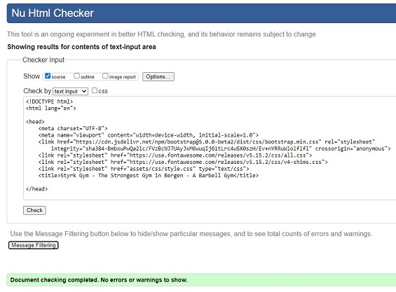

# Styrk Gym

One or two paragraphs providing an overview of your project.

Essentially, this part is your sales pitch.
 
## UX
 
Use this section to provide insight into your UX process, focusing on who this website is for, what it is that they want to achieve and how your project is the best way to help them achieve these things.

## User Stories

As a non-member of this gym, I want:

1. The first impression to tell me if this is the right gym for me.
2. Pricing information.
3. To see how the gym looks like.
5. To know about practical needs like: 
- Does the gym have lockers 
- Does the gym have changing room/wardrobe with shower.
- Parking, is it free?
6. To know if there is a reception.
7. Does the gym have a good variety of equipment?
8. Are there personel/personal trainers present that can assist me with whatever?
9. Is there a dress code?

As a member of this gym, I want:

1. To sign in, and see the status of my membership.
2. To be able to contact the owners of the gym.
3. The ability to see this gym on social media. 
4. To know the opening hours of the gym.
5. A personal trainer that can help me reach my goals.

This section is also where you would share links to any wireframes, mockups, diagrams etc. that you created as part of the design process. These files should themselves either be included as a pdf file in the project itself (in an separate directory), or just hosted elsewhere online and can be in any format that is viewable inside the browser.

### Wireframes 

[Balsamiq](https://www.balsamiq.com/) was used to make [wireframes](wireframes/) for mobile, tablet and desktop view.  

# Testing

## Code testing

Google's Lighthouse Test in Chrome Devtools:

Test score first test:

Test score after improvements:

## Code Validators

[W3C HTML Validator by Direct input](https://www.validator.w3.org/) 

- index.html results: No errors or warnings to show.

- membership.html results: No errors or warnings to show.

- gallery.html results: No errors or warnings to show.

- about-us.html results: No errors or warnings to show.

- contact.html results: No errors or warnings to show.

[W3C CSS Validator via Direct Entry](https://jigsaw.w3.org/css-validator/#validate_by_input)
v
- style.css results: No errors found.

## Features

In this section, you should go over the different parts of your project, and describe each in a sentence or so.
 
### Existing Features
- Feature 1 - allows users X to achieve Y, by having them fill out Z
- ...

For some/all of your features, you may choose to reference the specific project files that implement them, although this is entirely optional.

In addition, you may also use this section to discuss plans for additional features to be implemented in the future:

### Features Left to Implement
- Another feature idea

## Technologies Used

In this section, you should mention all of the languages, frameworks, libraries, and any other tools that you have used to construct this project. For each, provide its name, a link to its official site and a short sentence of why it was used.

- [JQuery](https://jquery.com)
    - The project uses **JQuery** to simplify DOM manipulation.

## Testing

In this section, you need to convince the assessor that you have conducted enough testing to legitimately believe that the site works well. Essentially, in this part you will want to go over all of your user stories from the UX section and ensure that they all work as intended, with the project providing an easy and straightforward way for the users to achieve their goals.

Whenever it is feasible, prefer to automate your tests, and if you've done so, provide a brief explanation of your approach, link to the test file(s) and explain how to run them.

For any scenarios that have not been automated, test the user stories manually and provide as much detail as is relevant. A particularly useful form for describing your testing process is via scenarios, such as:

1. Contact form:
    1. Go to the "Contact Us" page
    2. Try to submit the empty form and verify that an error message about the required fields appears
    3. Try to submit the form with an invalid email address and verify that a relevant error message appears
    4. Try to submit the form with all inputs valid and verify that a success message appears.

In addition, you should mention in this section how your project looks and works on different browsers and screen sizes.

You should also mention in this section any interesting bugs or problems you discovered during your testing, even if you haven't addressed them yet.

If this section grows too long, you may want to split it off into a separate file and link to it from here.

## Deployment

This section should describe the process you went through to deploy the project to a hosting platform (e.g. GitHub Pages or Heroku).

In particular, you should provide all details of the differences between the deployed version and the development version, if any, including:
- Different values for environment variables (Heroku Config Vars)?
- Different configuration files?
- Separate git branch?

In addition, if it is not obvious, you should also describe how to run your code locally.

## Credits

### Content
- The text for section Y was copied from the [Wikipedia article Z](https://en.wikipedia.org/wiki/Z)

### Media
- The photos used in this site were obtained from ...

### Acknowledgements

- I received inspiration for this project from X
