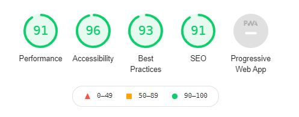

# Testing

## Code testing

Google's Lighthouse Test in Chrome Devtools:

How to test with Google Lighthouse:

1. Open Chrome DevTools.
2. Click on "Lighthouse in the small navigation menu.
3. Check the boxes on the right to select what you want to test.
4. Click on the blue label "Generate report".

Test score first test:

I got a score of 71 on performance. The reason behind this was because I had lots of images, and they were all original size. That was affecting the site's performance. After I had that sorted, the performance score improved.

Test score after improvements:

Also took a look on how to improve the SEO score. [This link](https://web.dev/meta-description/) provided me with information about meta description. After I added meta description to all my pages, SEO score was good:

## Code Validators

[W3C HTML Validator by Direct input](https://www.validator.w3.org/) 

- index.html results: No errors or warnings to show.

- membership.html results: No errors or warnings to show.

- gallery.html results: No errors or warnings to show.

- about-us.html results: No errors or warnings to show.

- contact.html results: No errors or warnings to show.

[W3C CSS Validator via Direct Entry](https://jigsaw.w3.org/css-validator/#validate_by_input)

- style.css results: No errors found.

## Responsiveness

Tools that were used to check for responsiveness were [Responsive Design Checker](https://www.responsivedesignchecker.com/) and [Chrome DevTools](https://developer.chrome.com/docs/devtools/).

## Browser Testing

## User Story Testing

The users of this site will be non-members and members.

As a non-member of this gym, I want:

As a non-member, I want to get a quick first impression so that I will get an idea of what kind of gym this is

- On the **home page** the user will see either a woman or a man training with a barbell. On desktop the viewer can clearly see both the carousel with quotes and the list with the gym's features. And on mobile devices the user can see the carousel with quotes. All of this will give some impressions that hopefully are in line with the project goals.

As a non-member, I want to see the pricing information so that I know what I get and pay for.

- On the **landing page** there is a call out saying "First month is free!". Also, if the user click on the **sign up button** on the top or bottom of the **home page**, they will be directed to the **membership page**. Here they find pricing information. 

As a non-member, I want to see how the gym looks, so that I know if it is the right place for me.

- The user will get a glimpse of how the gym looks like on the home page and the membership page, but mostly on the **gallery page**.

As a non-member, I want to know what type of members this gym has, so that I feel this comfortable in this gym. 

- The images across all pages gives an idea of the gyms member, but mostly when looking in the **gallery**. Also, the carousel on the **home page** containing quotes will show the feedback of four members.

As a non-member, I want to know the opening hours of this gym, so that I know it suits my schedule.

- If the user scrolls down a bit on the **home page** on mobile devices, the opening hours will show as part of the features list. On tablets and larger devices, the user doesn't have to scroll to see the opening hours.

As a non-member, I want to find the contact information of this gym, so that I can contact them if I want to.

- The user can find contact details in the **footer**, and also on the **contact page**.

As a non-member, I want to know what kind of equipment this gym has, so that I can train with the equipment I want to train with.

- On the **gallery page** the users can see different kinds of equipment.

As a non-member, I want to know who is running this gym, so that I can learn more about the owner.

- On the **landing page** there is information about the gym having "Certified personal trainers". If the user navigates to the **about us page**, they can learn about the owner and trainers.

As a non-member,  I want to know what to get/learn/experience from this gym. Do they have any classes?

- The user can expect to learn barbell movements from certified personal trainers, with either "one-on-one personal training", or on the "barbell basics group course". This is listed in the feature section of the **home page** and also on the **membership page**. 

As a member of this gym, I want:

As a member , I want to see membership alternatives, so that I know what is included and so that I know I have the right membership.

- The member of this gym can view membership alternatives in the **membership page**.

As a member , I want to find the contact information of this gym, so that I can contact the gym.

- The member of this gym can find contact information in the **contact page**, or look at the info in the **footer**.

As a member , I want the ability to see this gym on social media, so that I can see and learn more about the gym and the people who train there. 

- The member can click on the links in the **footer** to both instagram and facebook.

As a member , I want to know the opening hours of the gym, so that I know I can train when I want to.

- The member can see the opening hours in the feature section of the **home page**.

As a member, I want to learn more about the staff, so I know who they are and their skills/experience.

- The member can learn more about the staff in the **about us page**.

As a member , I want to learn more about the training classes they provide, so that I can think about joining one.

- The member can either see on the **home page** that the gym provides one-on-one personal training and a barbell basics group course, or click on the **membership** page. Here the member can learn that they have 1x free PT session and the barbell course is included in the membership.

## Bugs

Memberships: The biggest issue I had on this project was an issue with modals. I had working modals for the membership.html page, but on mobile it was not working. When I clicked the button to activate the modal, I would only get the dark modal background. I tried many different things to make it work, tried youtube, google, stack overflow and more. No results. Finally, after sleeping on it, I realized that the id # was unique for the tablet and desktop, but not for mobile. When I created a unique ID for mobile, it was working. See screenshots below for visual explanation.
 

Grid system:  I spent a lot of time trying to understand how the grid system worked. I could never manage to position elements at the right place and columns weren't the size I wanted them to be. I found it hard to use, and went back and forth to using the container-row-column hierarchy and d-flex/flexbox. After reading the bootstrap documentation and after some failing, I finally learned how to use them both. I ended up using mostly container-row-column hierarchy.

Gallery: First I used a bootstrap carousel to view images in the gallery page. The images were way too big, and it didn't seem right. After some googling I ended up with a responsive image grid system that both worked and looked better. 

Image sizes: As mentioned in the google lighthouse test, I had all my images in original size, affecting the performance in a bad way. I reduced all the image sizes in Microsoft Paint while keeping the aspect ratio.  

Footer: I had some issues with the icons and logo in the footer not being positioned where I wanted them to be. This only happened on the biggest screen size. Resolved the issue with making a container inside the container-fluid.

