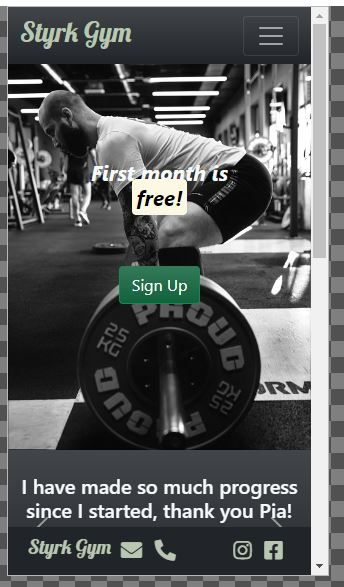
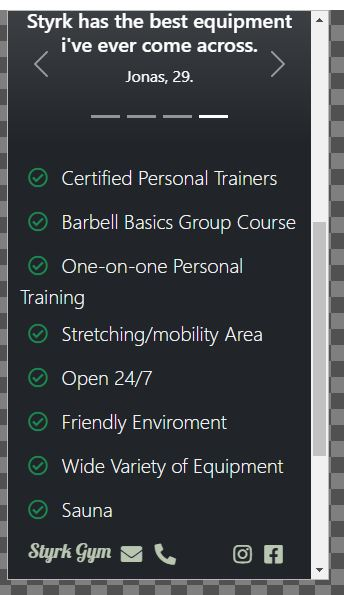

# Testing

## Code testing

Google's Lighthouse Test in Chrome Devtools:

Test score first test:

Test score after improvements:

## Code Validators

[W3C HTML Validator by Direct input](https://www.validator.w3.org/) 

- index.html results: No errors or warnings to show.

- membership.html results: No errors or warnings to show.

- gallery.html results: No errors or warnings to show.

- about-us.html results: No errors or warnings to show.

- contact.html results: No errors or warnings to show.

[W3C CSS Validator via Direct Entry](https://jigsaw.w3.org/css-validator/#validate_by_input)

- style.css results: No errors found.

## Responsiveness

## Browser Testing

## User Story Testing

## Bugs

