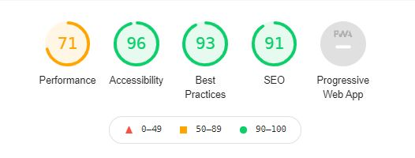

# Testing

## Code testing

Google's Lighthouse Test in Chrome Devtools:

How to test with Google Lighthouse:

1. Open Chrome DevTools.
2. Click on "Lighthouse in the small navigation menu.
3. Check the boxes on the right to select what you want to test.
4. Click on the blue label "Generate report".

Test score first test:

I got a score of 71 on performance. The reason behind this was because I had lots of images, and they where all original size. That was affecting the sites performance. After i had that sorted, the performance score improved.

Test score after improvements:

## Code Validators

[W3C HTML Validator by Direct input](https://www.validator.w3.org/) 

- index.html results: No errors or warnings to show.

- membership.html results: No errors or warnings to show.

- gallery.html results: No errors or warnings to show.

- about-us.html results: No errors or warnings to show.

- contact.html results: No errors or warnings to show.

[W3C CSS Validator via Direct Entry](https://jigsaw.w3.org/css-validator/#validate_by_input)

- style.css results: No errors found.

## Responsiveness

Tools that were used to check for responsiveness was [Responsive Design Checker](https://www.responsivedesignchecker.com/) and [Chrome DevTools](https://developer.chrome.com/docs/devtools/).

## Browser Testing

## User Story Testing

The users of this site will be non-members and members.

As a **non-member** of this gym, I want:

To get a quick first impression of what type of gym this is:

- On the home page the user will see either a woman or a man training with a barbell. On desktop the viewer can clearly see both the carousel with quotes and the list with the gym's features. And on mobile devices the user can see the carousel with qutoes. All of this will give some impressions that hopefully are in line with the project goals.

To see the pricing information. Can I expect any starting fees a campain or deals?

- On the landing page there is a call out saying "First month is free!". Also, if the user click on the sign up button on the top or bottom of the home page, they will be directed to the membership page. Here they find pricing information. 

To see how the gym looks like.

- The user will get a glimpse of how the gym looks like on the home page and the membership page, but mostly on the gallery page.

To get an idea of what the type of members this gym has. 

- The images across all pages gives an idea of the gyms member, but mostly when looking in the gallery. Also, the carousel containing quotes will show the feedback of four members.

To know the opening hours of this gym.

- If the user scrolls down a bit on mobile device, the opening hours will show as part of the features list. On tablets and larger devices, the user doesn't have to scroll to see the opening hours.

To find the contact information of this gym.

- The user can find contact details in the footer, and also on the contact page.

To know what kind of equipment this gym has.

- On the gallery page the users can see different kind of equipments.

To know who is running this gym, do they have personal trainers?

- On the landing page there is information about the gym having "Certified personal trainers". If the user navigates to the about us page, they can learn about the owner and trainers.

What can I expect to get/learn/experience from this gym. Do they have any classes?

- The user can expect to learn barbell movements from certified personal trainers, with either "one-on-one personal training", or on the "barbell basics group course". This is listed in the feature section of the home page. 

As a **member** of this gym, I want:

To see membership alternatives.

- The member of this gym can view membership alternatives in the membership page.

To find the contact information of this gym.

- The member of this gym can find contact information in the contact page, or look at the info in the footer.

The ability to see this gym on social media. 

- The member can click on the links in the footer to both instagram and facebook.

To know the opening hours of the gym.

- The member can see the opening hours in the feature section of the home page.

To learn more about the staff.

- The member can learn more about the staff in the about us page.

## Bugs

Grid system:  I spent a lot of time trying to understand how the grid system worked. I could never manage to position elements at the right place and columns weren't the size I wanted them to be. I found it hard to use, and went back and forth to using the container-row-column hierarchy and d-flex/flexbox. After reading the bootstrap documentation and after some failing, I finally learned how to use them both. I ended up with using mostly container-row-column hierarchy.

Gallery: First I used a bootstrap carousel to view images in the gallery page. The images were way to big, and it didn't seem right. After some googling I ended up with a responsive image grid system that both worked and looked better. 

Image sizes: As mentioned in the google lighthouse test, I had all my images in original size, affecting the performance in a bad way. I reduced all the image sizes in Microsoft Paint while keeping the aspect ratio.  

Footer: I had some issues with the icons and logo in the footer not being positioned where I wanted them to be. This only happened on the biggest screen size. Resolved the issue with making a container inside the container-fluid.

